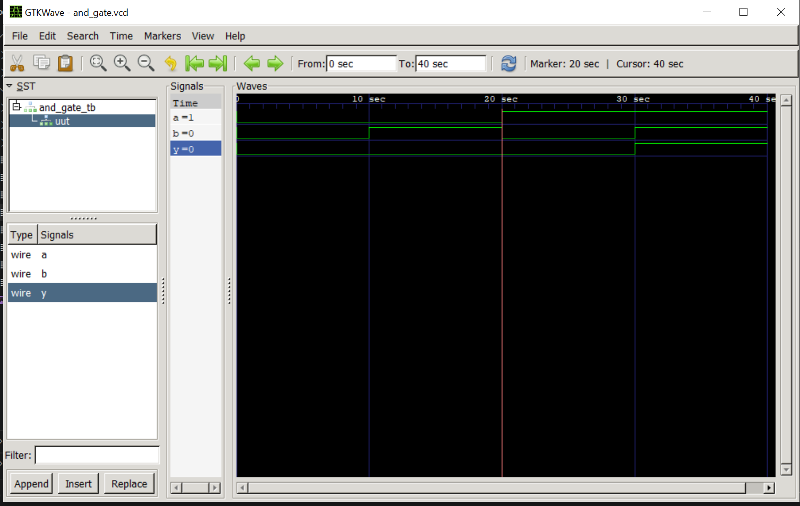
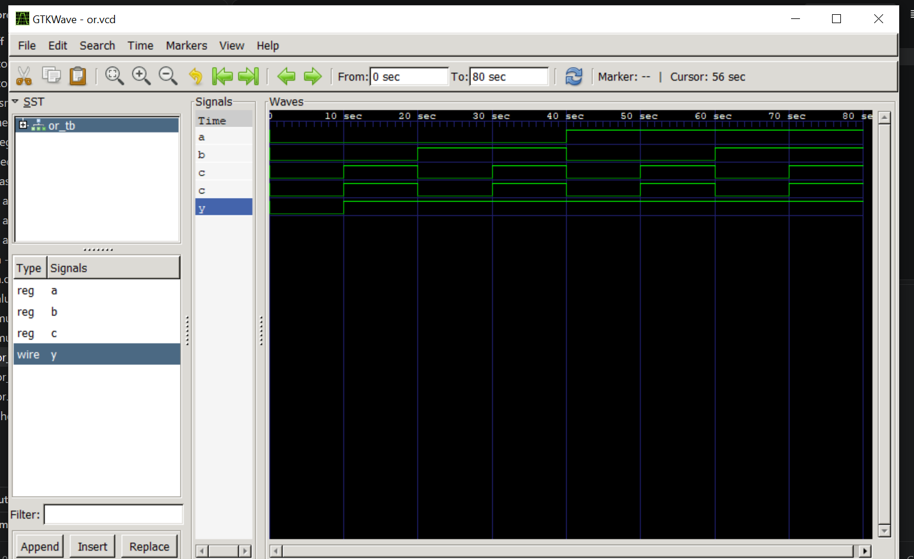
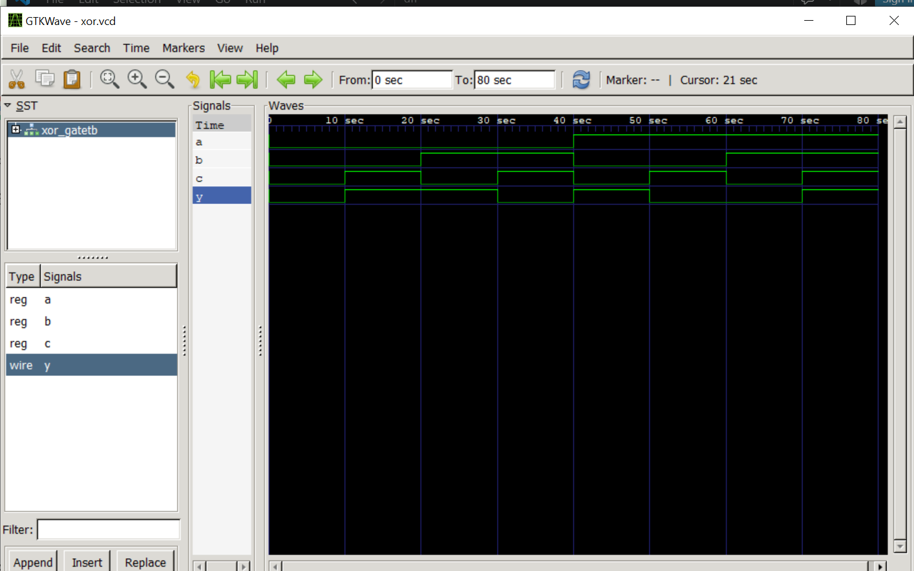
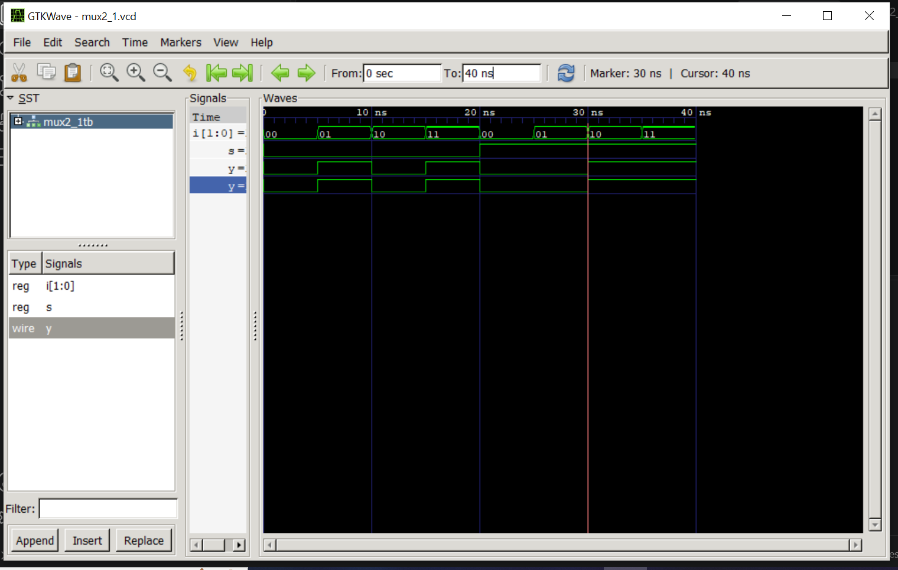
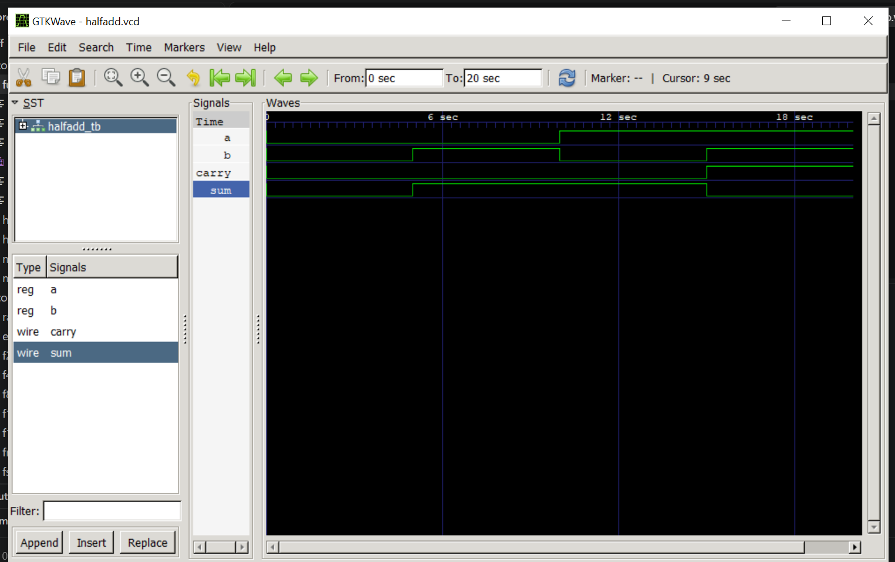
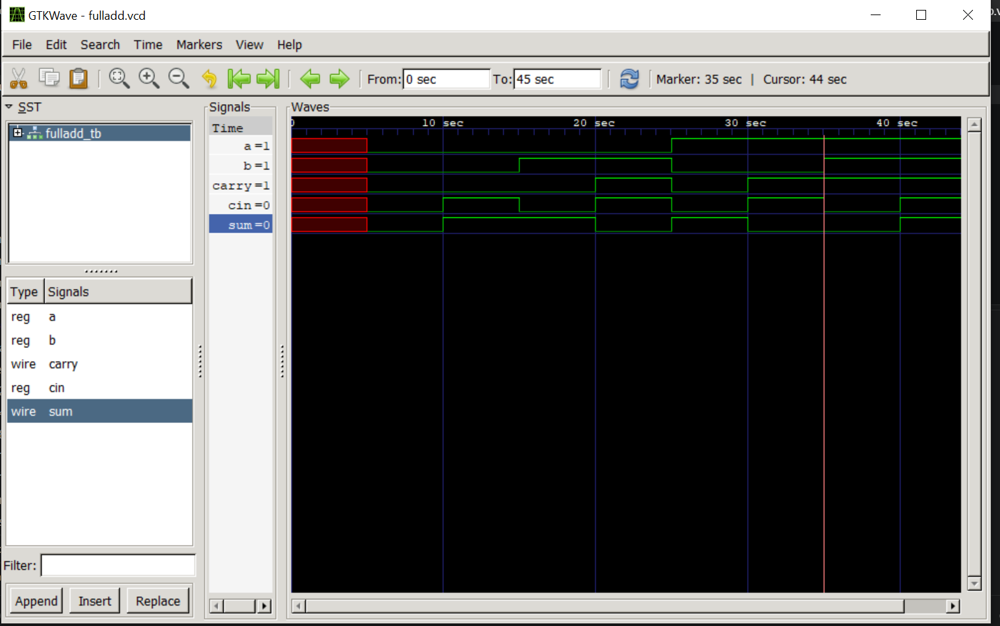

# Part E – Simulation and Waveform Verification

## Objective

The objective of Part E is to verify the functionality of the Verilog RTL modules developed during Task 1 through simulation and waveform analysis.

The designs were simulated using **Icarus Verilog**, and the resulting waveforms were analyzed using **GTKWave**.

---

## Simulation Flow

The verification process follows the workflow:

**Verilog RTL → Testbench → Icarus Verilog → Simulation → GTKWave → Waveform Analysis**

The testbench applies different input combinations to the Design Under Test (DUT). The simulation results are then viewed in GTKWave to verify the expected output behavior.

---

## 1. AND Gate

The AND gate was simulated with different input combinations.

The waveform verifies that the output is HIGH only when both inputs are HIGH.

---

## 2. OR Gate

The OR gate was simulated with different input combinations.

The waveform verifies that the output is HIGH when at least one input is HIGH.

---

## 3. XOR Gate

The XOR gate was simulated with different input combinations.

The waveform verifies that the output is HIGH when the two inputs are different.

---

## 4. 2:1 Multiplexer

The 2:1 Multiplexer was simulated using different input and select-line combinations.

The waveform verifies that the selected input is correctly transferred to the output.

---

## 5. Half Adder

The Half Adder was simulated for different combinations of the two input bits.

The waveform verifies the correct **Sum** and **Carry** outputs.

---

## 6. Full Adder

The Full Adder was simulated with different combinations of the two input bits and carry input.

The waveform verifies the correct **Sum** and **Carry-out** outputs.

---

## Verification Summary

| Circuit | Simulation Tool | Waveform Viewer | Status |
|---|---|---|---|
| AND Gate | Icarus Verilog | GTKWave | Verified |
| OR Gate | Icarus Verilog | GTKWave | Verified |
| XOR Gate | Icarus Verilog | GTKWave | Verified |
| 2:1 Multiplexer | Icarus Verilog | GTKWave | Verified |
| Half Adder | Icarus Verilog | GTKWave | Verified |
| Full Adder | Icarus Verilog | GTKWave | Verified |

---

## Tools Used

- **Verilog HDL** – RTL design
- **Icarus Verilog** – Compilation and simulation
- **GTKWave** – Waveform visualization and analysis
- **Ubuntu / WSL** – Linux development environment
- **Git and GitHub** – Version control and project documentation

---

## Conclusion

The developed digital circuits were simulated using Icarus Verilog and their signal transitions were analyzed using GTKWave.

The waveform results provide visual evidence of the functional behavior of the implemented RTL modules and demonstrate the basic simulation and verification workflow used in digital hardware design.
