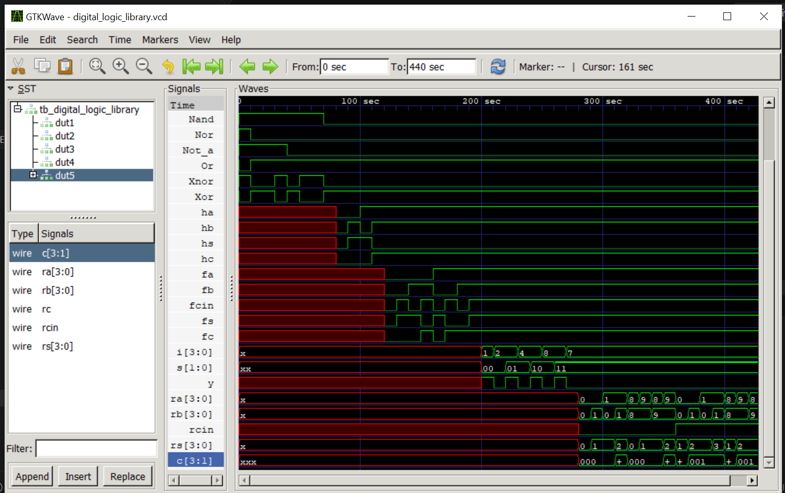

# Industry-Oriented Internship Program on VLSI Design and Semiconductor Engineering

## Task 1 Project Report

### Digital Electronics Fundamentals, Linux Environment Setup, Verilog HDL Programming, Simulation Workflow, and Basic Digital Circuit Design

**Intern:** Gopika Sujana  
**Program:** Sumerix Global VLSI Internship  
**Task:** Task 1  
**Domain:** VLSI Design and Semiconductor Engineering  
**HDL:** Verilog HDL  
**Repository:** [Sumerix-Global-VLSI-Internship](https://github.com/gopikasujana/Sumerix-Global-VLSI-Internship)

---

# 1. Introduction

Task 1 of the VLSI Design and Semiconductor Engineering Internship establishes the fundamental knowledge required for RTL design and digital system development.

The work completed as part of this task combines theoretical concepts in semiconductor technology and digital electronics with practical experience in Linux, Verilog HDL, RTL development, testbench creation, simulation, waveform verification, documentation, and Git-based version control.

The task progresses from semiconductor and digital logic fundamentals to the implementation and verification of a reusable Digital Arithmetic Logic Circuit Library.

---

# 2. Objectives

The major objectives of Task 1 were:

- Understand the semiconductor industry and VLSI design flow.
- Study ASIC and FPGA technologies.
- Understand front-end and back-end VLSI design.
- Review number systems, Boolean algebra, logic gates, and truth tables.
- Study introductory Karnaugh Map simplification.
- Set up a Linux/WSL-based VLSI development environment.
- Learn commonly used Linux commands.
- Understand Verilog HDL syntax and RTL coding.
- Develop basic combinational circuits.
- Create Verilog testbenches.
- Simulate designs using Icarus Verilog.
- Analyze generated waveforms using GTKWave.
- Design and verify a 4-bit Ripple Carry Adder.
- Develop a reusable digital logic circuit library.
- Maintain the project using Git and GitHub.
- Prepare engineering documentation for the completed work.

---

# 3. Tools and Technologies

| Tool / Technology | Purpose |
|-------------------|---------|
| Verilog HDL | RTL hardware description |
| Icarus Verilog | Compilation and simulation |
| GTKWave | Waveform visualization |
| Visual Studio Code | Verilog development |
| Linux / WSL | Development environment |
| Git | Version control |
| GitHub | Repository hosting |
| draw.io | Logic and RTL diagrams |
| Markdown | GitHub documentation |

---

# 4. VLSI Design Background

Very Large Scale Integration (VLSI) enables the implementation of complex electronic systems containing large numbers of transistors on integrated circuits.

A simplified digital VLSI development flow can be represented as:

```text
Specification
     ↓
Architecture
     ↓
RTL Design
     ↓
Functional Verification
     ↓
Logic Synthesis
     ↓
Physical Design
     ↓
Timing / Physical Verification
     ↓
Fabrication
     ↓
Packaging and Testing
```

Task 1 primarily focuses on the early front-end stages:

```text
Digital Logic
     ↓
Verilog RTL
     ↓
Testbench
     ↓
Simulation
     ↓
Waveform Verification
```

These stages form the foundation for more complex ASIC, FPGA, and SoC development.

---

# 5. ASIC and FPGA Fundamentals

ASIC stands for Application-Specific Integrated Circuit. It is designed for a particular application and can provide high performance, low power consumption, and optimized silicon area when manufactured at scale.

FPGA stands for Field-Programmable Gate Array. It contains programmable logic resources that allow hardware functionality to be configured after manufacturing.

The comparison between ASIC and FPGA technologies was studied as part of Part A.

Detailed work is available in:

[Part A – Semiconductor and VLSI Fundamentals](./Part-A/)

---

# 6. Digital Electronics Fundamentals

Part B focused on the theoretical foundation required for RTL design.

Topics studied included:

- Number systems
- Binary arithmetic
- Boolean algebra
- Logic gates
- Truth tables
- Boolean expressions
- Logic simplification
- Karnaugh Maps
- Combinational logic

Basic Boolean operations include:

```text
AND  : Y = A & B
OR   : Y = A | B
NOT  : Y = ~A
XOR  : Y = A ^ B
NAND : Y = ~(A & B)
NOR  : Y = ~(A | B)
XNOR : Y = ~(A ^ B)
```

These Boolean operations form the basis for the Verilog modules developed later in the task.

Detailed documentation is available in:

[Part B – Digital Electronics Fundamentals](./Part-B/)

---

# 7. Linux Development Environment

A Linux/WSL environment was used to understand the command-line workflow commonly used during HDL development.

Commands practiced included:

```bash
pwd
ls
cd
mkdir
cp
mv
rm
cat
nano
chmod
```

The Linux environment provides an efficient interface for managing RTL source files, invoking simulators, handling generated files, and working with Git.

The development environment included:

```text
Linux / WSL
     |
     +-- Visual Studio Code
     |
     +-- Icarus Verilog
     |
     +-- GTKWave
     |
     +-- Git
```

Detailed documentation is available in the Part C directory.

---

# 8. Verilog HDL Fundamentals

Part D introduced Verilog HDL and basic RTL implementation.

The following concepts were practiced:

- Module declaration
- Input and output ports
- `wire`
- `reg`
- Operators
- Continuous assignment
- `always` blocks
- `initial` blocks
- Combinational circuit description

Basic modules developed include:

```text
AND Gate
OR Gate
XOR Gate
2:1 Multiplexer
Half Adder
Full Adder
```

Example of a simple RTL description:

```verilog
module and_gate(
    input a,
    input b,
    output y
);

assign y = a & b;

endmodule
```

The source code for these modules is maintained in the Part D section of this repository.

---

# 9. Half Adder

A Half Adder performs binary addition of two one-bit values.

Inputs:

```text
A
B
```

Outputs:

```text
Sum
Carry
```

Boolean equations:

```text
Sum   = A XOR B
Carry = A AND B
```

Truth table:

| A | B | Sum | Carry |
|---|---|-----|-------|
| 0 | 0 | 0 | 0 |
| 0 | 1 | 1 | 0 |
| 1 | 0 | 1 | 0 |
| 1 | 1 | 0 | 1 |

---

# 10. Full Adder

A Full Adder performs one-bit binary addition while including an incoming carry.

Inputs:

```text
A
B
Cin
```

Outputs:

```text
Sum
Cout
```

The Full Adder is an important building block because multiple Full Adders can be cascaded to create multi-bit arithmetic circuits.

The same concept was later used to construct the 4-bit Ripple Carry Adder.

---

# 11. Multiplexer

Multiplexers select one input from multiple data inputs based on the value of select signals.

During Task 1, 2:1 and 4:1 multiplexer concepts were studied and implemented.

A 4:1 multiplexer contains:

```text
4 data inputs
2 select inputs
1 output
```

For select lines `S1:S0`:

| S1 | S0 | Selected Input |
|----|----|----------------|
| 0 | 0 | I0 |
| 0 | 1 | I1 |
| 1 | 0 | I2 |
| 1 | 1 | I3 |

---

# 12. Testbench Development

Functional verification was performed using Verilog testbenches.

A testbench provides stimulus to the Design Under Test (DUT) and allows the resulting outputs to be observed.

The general verification structure used was:

```text
        Testbench
            |
            | Input Stimulus
            v
     +---------------+
     |      DUT      |
     |  Verilog RTL  |
     +---------------+
            |
            | Outputs
            v
      VCD Waveform
            |
            v
         GTKWave
```

Testbench development included:

- DUT instantiation
- Input stimulus generation
- Timing delays
- Output observation
- VCD waveform generation
- Functional verification

---

# 13. Simulation Workflow

Icarus Verilog was used to compile and execute the Verilog designs.

A typical simulation workflow was:

```text
Verilog RTL
     +
Testbench
     ↓
Icarus Verilog
     ↓
Simulation
     ↓
VCD File
     ↓
GTKWave
     ↓
Waveform Analysis
     ↓
Functional Verification
```

A typical command sequence is:

```bash
iverilog -o simulation design.v testbench.v
vvp simulation
gtkwave waveform.vcd
```

For the Part H library, the source files can be compiled together with the testbench, for example:

```bash
iverilog -o sim.vvp tb_digital_logic_library.v logic_gates.v halfadder.v fulladder.v mux4_1.v ripplecarry.v
vvp sim.vvp
gtkwave digital_logic_library.vcd
```

---

# 14. Waveform Verification

GTKWave was used to inspect simulation signals and confirm the relationship between testbench inputs and RTL outputs.

Waveform analysis provides visual verification of:

- Logic gate behaviour
- Half Adder outputs
- Full Adder outputs
- Multiplexer selection
- Ripple Carry Adder operation
- Carry propagation

Waveform verification is important because successful compilation alone does not prove that an RTL module implements the required functionality.

---

# 15. 4-Bit Ripple Carry Adder

Part F focused on a mini RTL design: a 4-bit Ripple Carry Adder.

A Ripple Carry Adder is built by cascading Full Adders.

```text
A0,B0 ---> [FA0] ---> C1
             |
             S0

A1,B1,C1 -> [FA1] ---> C2
             |
             S1

A2,B2,C2 -> [FA2] ---> C3
             |
             S2

A3,B3,C3 -> [FA3] ---> Cout
             |
             S3
```

The carry output generated by each Full Adder becomes the carry input of the next stage.

The resulting circuit performs:

```text
{Cout, Sum[3:0]} = A[3:0] + B[3:0] + Cin
```

The implementation, testbench, and simulation result are available in:

[Part F – 4-bit Ripple Carry Adder](./PartF/)

---

# 16. Engineering Documentation

Part G contains engineering documentation supporting the RTL work.

Documentation includes:

- Logic gate diagrams
- Truth tables
- Combinational logic diagrams
- Simulation workflow
- Project organization
- README documentation

Available here:

[Part G – Engineering Documentation](./Part-G/)

---

# 17. Mini Project

## Digital Arithmetic Logic Circuit Library Using Verilog HDL

The final activity of Task 1 was the development of a reusable Digital Arithmetic Logic Circuit Library.

The mini project integrates several individual concepts studied throughout Task 1 into one verified Verilog project.

Implemented components include:

```text
Digital Logic Library
│
├── Basic Logic Gates
│
├── Half Adder
│
├── Full Adder
│
├── 4:1 Multiplexer
│
└── 4-bit Ripple Carry Adder
```

The project contains the following primary files:

```text
Part-H/
├── README.md
├── logic_gates.v
├── halfadder.v
├── fulladder.v
├── mux4_1.v
├── ripplecarry.v
├── tb_digital_logic_library.v
└── digital_logic_library.png
```

The complete mini project is available here:

[Part H – Digital Arithmetic Logic Circuit Library](./Part-H/)

---

# 18. Mini Project Waveform

The testbench verifies the different digital circuit modules and produces waveform output for inspection in GTKWave.

The simulation screenshot is shown below:



The waveform provides visual evidence of the applied stimulus and resulting outputs for the implemented RTL blocks.

---

# 19. Repository Organization

Task 1 was divided according to the internship specification.

```text
Task-1/
│
├── Part-A/               Semiconductor and VLSI Fundamentals
├── Part-B/               Digital Electronics Fundamentals
├── partc/                Linux Environment Setup
├── partD/                Verilog HDL Fundamentals
├── PartE/                Simulation and Testbench Development
├── PartF/                4-bit Ripple Carry Adder
├── Part-G/               Engineering Documentation
├── Part-H/               Digital Logic Library Mini Project
├── Daily Progress Log/   Daily activity record
├── README.md
└── PROJECT_REPORT.md
```

> Note: Folder naming can be standardized to `Part-A` through `Part-H` for improved consistency.

---

# 20. Daily Progress

A daily progress record was maintained during Task 1.

The activities included:

| Stage | Work Completed |
|-------|----------------|
| 1 | Task requirements and repository planning |
| 2 | Semiconductor fundamentals and ASIC vs FPGA |
| 3 | Digital electronics and truth tables |
| 4 | Linux/WSL environment practice |
| 5 | Icarus Verilog and GTKWave setup |
| 6 | Logic gate RTL implementation |
| 7 | MUX, Half Adder, and Full Adder development |
| 8 | Testbench development and simulation |
| 9 | Waveform verification and Ripple Carry Adder |
| 10 | Documentation and GitHub organization |

The complete record is available in:

[Daily Progress Log](./Daily%20Progress%20Log/)

---

# 21. Skills Developed

Task 1 provided practical experience in:

- Digital electronics
- Boolean logic
- VLSI fundamentals
- ASIC and FPGA concepts
- Linux command-line operation
- Verilog HDL
- Combinational RTL design
- Modular hardware design
- Testbench development
- Functional simulation
- Waveform debugging
- GTKWave
- Icarus Verilog
- Git
- GitHub
- Technical documentation

---

# 22. Verification Summary

The implemented RTL designs were evaluated using testbench-driven functional simulation.

The verification workflow consisted of:

```text
Design
   ↓
Compile
   ↓
Apply Test Vectors
   ↓
Run Simulation
   ↓
Generate VCD
   ↓
Open GTKWave
   ↓
Compare Inputs/Outputs
   ↓
Verify Functionality
```

The available simulation results demonstrate the expected functional behaviour of the implemented combinational modules and the Ripple Carry Adder for the applied test vectors.

---

# 23. Deliverables Status

| Deliverable | Status |
|-------------|--------|
| Verilog source files | ✅ Completed |
| Logic gates | ✅ Completed |
| Half Adder | ✅ Completed |
| Full Adder | ✅ Completed |
| Multiplexer | ✅ Completed |
| 4-bit Ripple Carry Adder | ✅ Completed |
| Testbench files | ✅ Completed |
| Simulation | ✅ Completed |
| GTKWave evidence | ✅ Completed |
| Logic diagrams | ✅ Completed |
| Truth tables | ✅ Completed |
| Engineering documentation | ✅ Completed |
| GitHub repository | ✅ Completed |
| README documentation | ✅ Completed |
| Daily progress log | ✅ Completed |
| Linux documentation | ✅ Completed |
| Consolidated project report | ✅ This document |
| K-map solutions | ⚠️ Verify before final submission |
| Final project report PDF | ⚠️ Export/upload this report as PDF if required |

---

# 24. Task 1 to Future RTL Development

The modules implemented during this task represent fundamental building blocks for more complex digital systems.

```text
Logic Gates
     ↓
Adders / Multiplexers
     ↓
Combinational RTL
     ↓
Sequential Logic
     ↓
Registers / Counters
     ↓
Finite State Machines
     ↓
ALU
     ↓
Datapath + Control
     ↓
Processor
```

This progression supports the internship's future capstone direction:

**32-bit RISC Processor Design and Verification**

---

# 25. Learning Outcomes

After completing Task 1, I developed an understanding of how digital logic concepts are translated into RTL hardware descriptions and verified before moving to later stages of the VLSI design flow.

The task provided practical experience in:

- Understanding the basic semiconductor/VLSI design workflow.
- Comparing ASIC and FPGA technologies.
- Applying Boolean logic to digital circuits.
- Working with a Linux development environment.
- Writing Verilog HDL modules.
- Building reusable RTL components.
- Creating testbenches.
- Performing functional simulation.
- Analyzing digital waveforms.
- Documenting engineering work.
- Maintaining source code through Git and GitHub.

---

# 26. Challenges and Observations

One of the important observations from this task is that writing Verilog code is only one part of RTL development. Verification is equally important.

A design may compile successfully while still producing incorrect logical behaviour. Testbenches and waveform analysis therefore play an essential role in validating RTL functionality.

The Ripple Carry Adder also demonstrated the importance of hierarchical design. A complex arithmetic circuit can be created by combining smaller verified Full Adder modules.

---

# 27. Conclusion

Task 1 established the foundation required for further study of RTL design and VLSI engineering.

The work progressed from semiconductor and digital electronics fundamentals to Linux-based development, Verilog programming, testbench development, simulation, waveform verification, and a complete mini project.

The final Digital Arithmetic Logic Circuit Library integrates logic gates, Half Adder, Full Adder, Multiplexer, and Ripple Carry Adder modules into a reusable collection of Verilog components.

The completed work provides a foundation for Task 2, which extends these concepts into combinational and sequential RTL design, counters, registers, finite state machines, parameterized designs, timing concepts, and more advanced verification.

---

# 28. References

The following resources are useful for the concepts and tools applied during Task 1:

- [Icarus Verilog](https://steveicarus.github.io/iverilog/)
- [GTKWave](https://gtkwave.sourceforge.net/)
- [Git Documentation](https://git-scm.com/doc)
- [Visual Studio Code](https://code.visualstudio.com/)
- [HDLBits](https://hdlbits.01xz.net/)
- [EDA Playground](https://www.edaplayground.com/)
- [NPTEL](https://nptel.ac.in/)
- [MIT OpenCourseWare](https://ocw.mit.edu/)
- IEEE 1364 Verilog HDL standard

---

# 29. Author

**Gopika Sujana**

Industry-Oriented Internship Program on  
**VLSI Design and Semiconductor Engineering**

Sumerix Global VLSI Internship

GitHub Repository:  
https://github.com/gopikasujana/Sumerix-Global-VLSI-Internship

---

## Final Status

**Task 1: Substantially Completed ✅**

The core RTL development, simulation, mini project, documentation, and GitHub organization are present. Before final submission, K-map evidence and the final PDF report should be confirmed against the internship deliverables.
